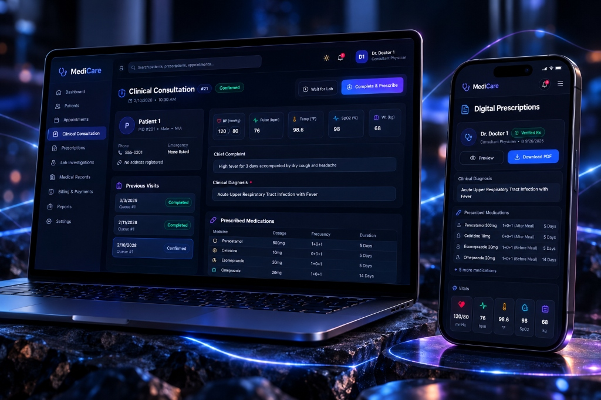
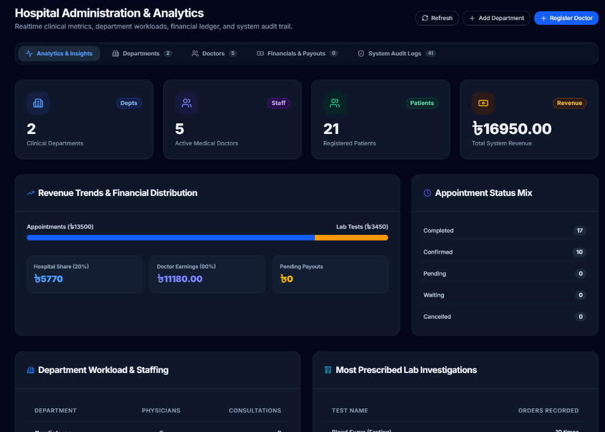
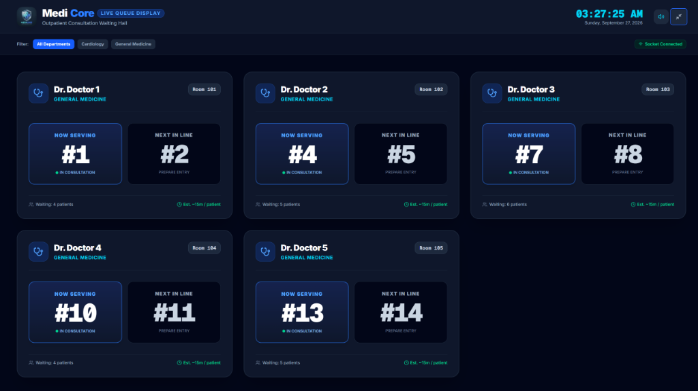

<div align="center">
  

  <h1>🏥 MediCore - Smart Hospital Management System</h1>
  <p><strong>Enterprise-grade healthcare ecosystem featuring real-time doctor consultation cockpits, live patient queue dispatching, automated digital prescriptions, and robust clinical administration.</strong></p>

  <p>
    <a href="https://medicore.shahidur.dev" target="_blank"></a>
    
    
    
    
  </p>
</div>

---

## 🌟 Overview
MediCore is a comprehensive, full-stack hospital management platform built to streamline the complex workflows of modern clinical environments. It provides highly tailored, real-time dashboards for **Administrators**, **Doctors**, **Patients**, and **Lab Technicians**.

**Live Demo URL:** [https://medicore.shahidur.dev](https://medicore.shahidur.dev)  
*(To test the platform, log into any account. **The universal password for all dummy accounts—including Admin, Doctors, and Patients—is `MediCore`**.)*

> [!TIP]
> **Admin Dual-Mode Security:** The live Admin Panel uses a custom TOTP elevation system. When logging in as `admin`, you are securely granted "Read-Only Guest Admin" access. To unlock full write permissions, you must possess the Super Admin's Google Authenticator secret code.

## 🚀 Key Technical Features
*   **Real-time Architecture:** Bidirectional WebSocket (Socket.IO) event bus for live queue progression, instant doctor call announcements, and notification toasts.
*   **Role-Based Access Control (RBAC):** Secure JWT authentication strictly routing users (Admin, Doctor, Patient, Lab) to their specific data contexts.
*   **Digital Prescription Authoring:** Doctors can generate robust PDF prescriptions with diagnoses, ICD-10 notes, and medication dosages natively in the browser.
*   **Automated CRON Maintenance:** Built-in backend CRON jobs that automatically wipe demo/temporary users every 3 months while protecting core system data.
*   **Financial & Payment Ledger:** Tracks payments, implements SSLCommerz sandbox for dummy payment workflows, and splits commissions between the hospital (admin) and doctors.
*   **Responsive UI/UX:** Built with Tailwind CSS, utilizing modern glassmorphism, dynamic gradients, and fluid mobile-first layouts.

## 🔄 What's New in v2.0 (The Big Migration)
MediCore recently underwent a massive architectural overhaul to improve scalability, real-time capabilities, and modern deployment standards:
*   **Database Migration (Oracle to MySQL 8):** Replaced legacy Oracle 11g with a lightweight, cloud-friendly MySQL 8 architecture.
*   **Real-time Infrastructure:** Replaced static REST polling with **Socket.IO** for instantaneous patient queue updates and doctor notifications.
*   **Next.js UI Revamp:** Entire frontend rewritten to leverage Next.js App Router with highly interactive dashboards and Tailwind CSS glassmorphism.
*   **Payment Gateway Integration:** Added an **SSLCommerz** sandbox for processing dummy lab test and appointment payments natively.
*   **Automated Database Maintenance:** Implemented a backend **CRON job system** to prevent cloud database hibernation and automatically purge temporary users every 3 months.

## 📄 Output Samples
*   **Digital Prescription PDF:** The system automatically generates professional, printable PDFs from the doctor's cockpit.
    *   👉 **[View Sample Prescription PDF](assets/sample_prescription.pdf)**

---

## 🛠 Tech Stack

### Frontend
*   **Framework:** Next.js 14 (App Router) / React 18
*   **Language:** TypeScript
*   **Styling:** Tailwind CSS, Framer Motion
*   **Icons:** Lucide React
*   **PDF Generation:** `@react-pdf/renderer`

### Backend
*   **Runtime:** Node.js
*   **Framework:** Express.js
*   **Real-time:** Socket.IO
*   **Security:** JWT, `bcryptjs`, Helmet, Express Rate Limiter
*   **Task Scheduling:** `node-cron`

### Database
*   **RDBMS:** MySQL 8.0+
*   **Driver:** `mysql2` (Connection Pooling) & Prisma
*   **Schema:** Highly normalized relational schema (10 core tables)

---

## 📸 System Previews

| Patient Dashboard | Doctor Consultation Cockpit |
| :---: | :---: |
|  |  |

| Hospital Admin Panel | Live Outpatient Queue TV |
| :---: | :---: |
|  |  |

| Lab Technician Portal | |
| :---: | :---: |
|  | |

### 📊 Database Architecture (ER Diagram)
<div align="center">
  
</div>

---

## 💻 Getting Started (Local Setup)

### 1. Prerequisites
*   Node.js (v18 or higher recommended)
*   MySQL Server (v8.0+)
*   Git

### 2. Database Setup
1. Open your MySQL client (e.g., MySQL Workbench, phpMyAdmin, or terminal).
2. Create a database named `medicore`.
3. Locate the DDL script at `database/FULL DDL.sql` and run it to construct the tables.
4. Locate the seeding script at `database/mysql_seed.sql` and run it to populate the database with default departments, doctors, and patients.

### 3. Backend Setup
```bash
cd backend
npm install
```
Create a `.env` file in the `backend` directory:
```env
PORT=5000
NODE_ENV=development
BACKEND_URL=http://localhost:5000
CLIENT_URL=http://localhost:3000

# MySQL Database Credentials
DB_HOST=localhost
DB_PORT=3306
DB_USER=root
DB_PASSWORD=your_mysql_password
DB_NAME=medicore
DB_SSL=false

# Security
JWT_SECRET=your_super_secret_key_here
```
Start the backend server:
```bash
npm run dev
```

### 4. Frontend Setup
Open a new terminal window:
```bash
cd frontend
npm install
```
Create a `.env.local` file in the `frontend` directory:
```env
NEXT_PUBLIC_API_URL=http://localhost:5000
```
Start the frontend server:
```bash
npm run dev
```

---

## 🔑 Demo Credentials
Access the application at `http://localhost:3000` (or the live URL) and use the following default credentials to test the RBAC features:

| Role | Username | Password |
| :--- | :--- | :--- |
| **Admin** | `admin` | `password123` |
| **Doctor** | `doctor1` *(up to `doctor5`)* | `password123` |
| **Patient** | `patient1` *(up to `patient5`)* | `password123` |
| **Lab Tech** | `lab` | `password123` |

*(Note: If testing on the Live URL, these credentials reset automatically every 3 months via the CRON job).*

---

## ☁️ Deployment Guide
If you wish to deploy this stack yourself to production:
1. **Frontend:** Deploy to [Vercel](https://vercel.com/) by importing the `/frontend` directory and setting the `NEXT_PUBLIC_API_URL` environment variable.
2. **Backend:** Deploy to a VPS (e.g., Oracle Cloud, AWS EC2, DigitalOcean). Use `PM2` to keep the Node process running, and configure `Nginx` as a reverse proxy to route traffic to port `5000` and handle WebSocket upgrades. Secure with `Certbot` for SSL.
3. **Database:** Host the MySQL instance on a cloud provider like Aiven, Supabase (PostgreSQL equivalent), or locally on your VPS.

---

## 👨‍💻 Developer & Contact

Designed and engineered by **Shahidur Rahman**.

*   🌐 **Portfolio:** [shahidur.dev](https://shahidur.dev)
*   🐙 **GitHub:** [@shahidur8381](https://github.com/Shahidur8381)
*   ✈️ **Telegram:** [@shahidur8381](https://t.me/shahidur8381)
*   💬 **WhatsApp:** [@shahidur8381](https://wa.me/shahidur8381)

---

## 🔮 Future Roadmap & Open Source

This project is actively maintained and will receive continuous upgrades in the future, including AI-driven diagnostics, advanced analytics dashboards, and enhanced payment flows.

**Open Source Policy:**
MediCore is an open-source project. You are highly encouraged to **fork** this repository, learn from the codebase, and use it for your own educational or personal projects! 

However, if you utilize this codebase for commercial purposes, use it in a public portfolio, or create derivative works, **proper credit and attribution to the original author (Shahidur Rahman) is required and greatly appreciated.** If you like the project, don't forget to ⭐ star the repo!

